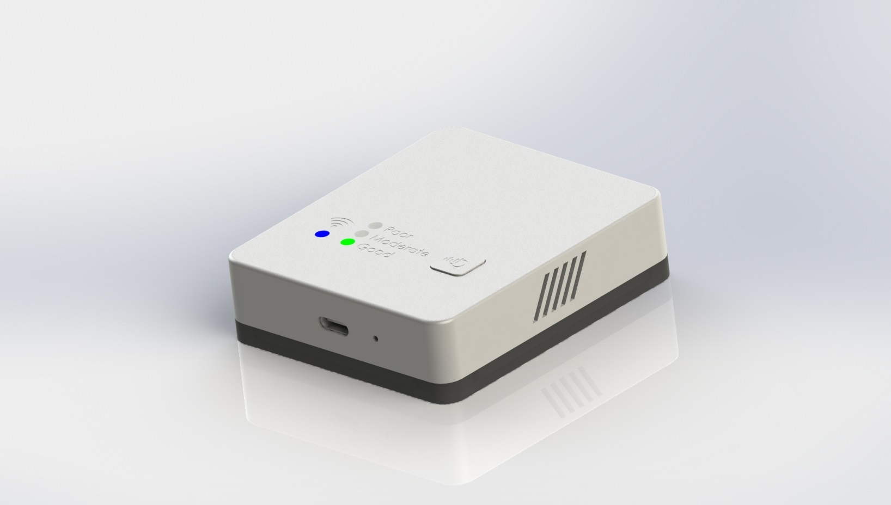
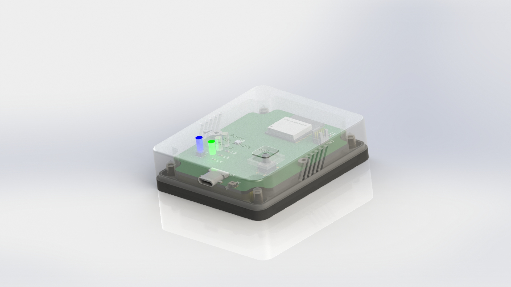

# Humi Device
The humi device is a portable air qualitity measure device which is connected to a MQTT Broker. This enables
a flexible way the measure the air qualitity without any cable management. The device is powered by a 2000mAh battery
and can be recharged with any 5V USB-C charger. 

# Contribute
The project is documented in 

## IDE and SDK
The ESP32-C3 is used as main CPU and WLAN module. Ensure you have installed the ESP-IDF Framework on your 
development machine according to [docs](https://docs.espressif.com/projects/esp-idf/en/latest/esp32c3/get-started/index.html#step-1-install-prerequisites)

As standard IDE Visual Studio Code is used, open the `firmware` Folder.

# Knowing Issues
**Rev0** fixed in Rev1
- [x] PCB - Label "2000mAh @ 3.7V" is mirrored pn PCB back side
- [x] PCB - CN1 Label is mirrored on PCB back side
- [x] PCB - Wrong Buck Converter Footprint
- [x] BOM - Wrong Supplier Part Number for B5. Should be SSAL220100
- [x] Case - Bottom case has infinity small border for screw holder

**Rev1**
none
